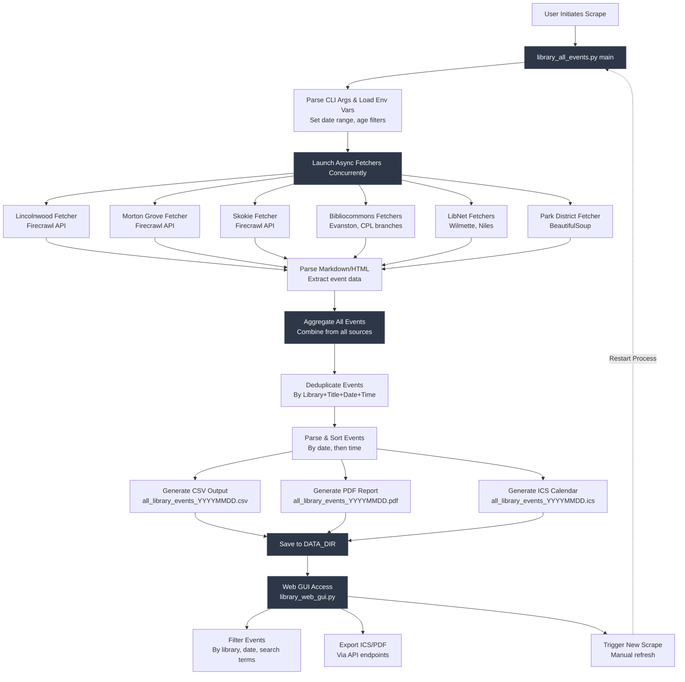

# Library Event Scraper Architecture

## Data Flow Diagram



## Component Details

### Scraper Core (`library_all_events.py`)

**Input:**
- CLI arguments: `--start-date`, `--days`, `--start-offset-days`
- Environment: `FIRECRAWL_API_KEY`, `TIMEZONE`, `DATA_DIR`

**Process:**
1. **Concurrent Fetching** - Uses `asyncio.gather()` to run 8+ library fetchers in parallel
2. **Error Handling** - Individual failures don't crash entire scrape
3. **Retry Logic** - Exponential backoff for network/rate limit errors
4. **Text Cleaning** - Removes markdown, normalizes whitespace
5. **Age Filtering** - LibNet libraries filter for K-2, 3-5 grades

**Output:**
- CSV file (primary data format)
- PDF report (formatted for printing)
- ICS calendar (importable to Google Calendar, etc.)

### Web Interface (`library_web_gui.py`)

**Routes:**
- `GET /` - Main HTML interface
- `GET /api/events` - Filtered events JSON
- `POST /api/scrape` - Trigger new scrape
- `GET /api/scrape/status` - Check scrape progress
- `GET /api/export/ics` - Download ICS file
- `GET /api/export/pdf` - Download PDF file

**Features:**
- Real-time filtering without page reload
- Advanced search (any/all/exact/fuzzy matching)
- Multi-field search (title, description, location, age)
- Progress tracking for long-running scrapes

### Library Fetchers

| Library | System | Method | Key Features |
|---------|--------|--------|--------------|
| Lincolnwood | Custom | Firecrawl | Markdown parsing, date regex |
| Morton Grove | Custom | Firecrawl | Markdown parsing, age extraction |
| Skokie | Custom | Firecrawl | Markdown parsing, location cleanup |
| Evanston | Bibliocommons | API | Pagination, structured data |
| CPL Branches | Bibliocommons | API | Per-branch filtering |
| Wilmette | LibNet | API | JSON endpoint, age filtering |
| Niles | LibNet | API | JSON endpoint, age filtering |
| Chicago Parks | Custom | BeautifulSoup | HTML parsing |

## Event Schema

All fetchers return events in this standardized format:

```python
{
    "Library": str,          # "Lincolnwood Library"
    "Title": str,            # "Storytime for Kids"
    "Date": str,             # "2025-12-20"
    "Time": str,             # "2:30 PM" or "All Day"
    "Location": str,         # "Main Room" or "N/A"
    "Age Group": str,        # "Grades K-2" or "All Ages"
    "Program Type": str,     # "Story Time" or "Not found"
    "Description": str,      # Event details
    "Link": str              # Full URL or "N/A"
}
```

## Deployment Architecture

### Render.com Production

```
┌─────────────────────────────────────┐
│  Render Cron Job (Daily 6 AM)      │
│  python library_all_events.py       │
└──────────┬──────────────────────────┘
           │
           v
┌─────────────────────────────────────┐
│  Persistent Disk: /opt/render/...   │
│  - all_library_events_*.csv         │
│  - all_library_events_*.pdf         │
│  - all_library_events_*.ics         │
└──────────┬──────────────────────────┘
           │
           v
┌─────────────────────────────────────┐
│  Gunicorn Web Server (2 workers)    │
│  library_web_gui.py                 │
│  Port: $PORT (from Render)          │
└─────────────────────────────────────┘
```

### Local Development

```
┌─────────────────────────────────────┐
│  Terminal 1: Run Scraper            │
│  python library_all_events.py       │
└──────────┬──────────────────────────┘
           │
           v
┌─────────────────────────────────────┐
│  Local File System: ./data/         │
│  - all_library_events_*.csv         │
│  - all_library_events_*.pdf         │
│  - all_library_events_*.ics         │
└──────────┬──────────────────────────┘
           │
           v
┌─────────────────────────────────────┐
│  Terminal 2: Run Web Server         │
│  python library_web_gui.py          │
│  http://localhost:5000              │
└─────────────────────────────────────┘
```

## Error Handling & Resilience

### Retry Strategy

```python
# retry_with_backoff() function
Attempt 1 -> Fail -> Wait 1s
Attempt 2 -> Fail -> Wait 2s
Attempt 3 -> Fail -> Wait 4s
Attempt 4 -> Success ✓

Handles:
- ConnectionError
- Timeout
- HTTPError (429 rate limit)
```

### Failure Isolation

- Each library fetcher runs independently
- One library failure doesn't stop others
- Failed fetchers return empty list `[]`
- All errors logged to `library_events.log`

### Data Validation

- Events with missing required fields are logged but not included
- Dates must be parseable (multiple formats supported)
- Text cleaned to ASCII (removes problematic characters)
- Deduplication prevents double-counting

## Performance Characteristics

### Scraping Speed

- **Sequential**: ~5-8 minutes for all libraries
- **Parallel (current)**: ~2-3 minutes for all libraries
- **Bottleneck**: Firecrawl API rate limiting (1 concurrent request)

### Resource Usage

- **Memory**: ~100-200 MB during scraping
- **Disk**: ~1-5 MB per output file set
- **Network**: ~50-100 API calls per full scrape

### Optimization Opportunities

1. Increase `FIRECRAWL_CONCURRENCY` if API allows
2. Cache Firecrawl responses for development
3. Implement incremental updates (only fetch new events)
4. Use connection pooling for HTTP requests

## Security Considerations

### API Key Management

- ✅ Firecrawl API key in environment variable
- ✅ `.env` file in `.gitignore`
- ⚠️ Default key in code should be removed for production

### Input Validation

- Web GUI search terms not sanitized for XSS
- File paths constructed from `DATA_DIR` (validate!)
- No authentication on web GUI (anyone can trigger scrapes)

### Recommendations

1. Add rate limiting to web scrape endpoint
2. Implement API authentication
3. Sanitize all user input before HTML display
4. Use absolute paths, validate `DATA_DIR`
5. Add CSRF protection for state-changing operations

## Monitoring & Observability

### Logs

```
library_events.log (rotating, 2 MB max, 3 backups)

Key log lines:
- "Fetching [Library] events..." (start)
- "Found X events for [Library]" (success)
- "Total events after de-duplication: X" (final count)
- ERROR messages with stack traces (failures)
```

### Metrics to Track

- Events per library per scrape
- Scrape duration (total and per library)
- API failure rate
- Duplicate event rate
- User interactions (web GUI)

### Alerting Triggers

- Zero events returned for all libraries
- Scrape fails for >2 consecutive runs
- API key expiration/invalidity
- Disk space <100 MB remaining

---

*For detailed function references, see [CLAUDE.md](CLAUDE.md)*
