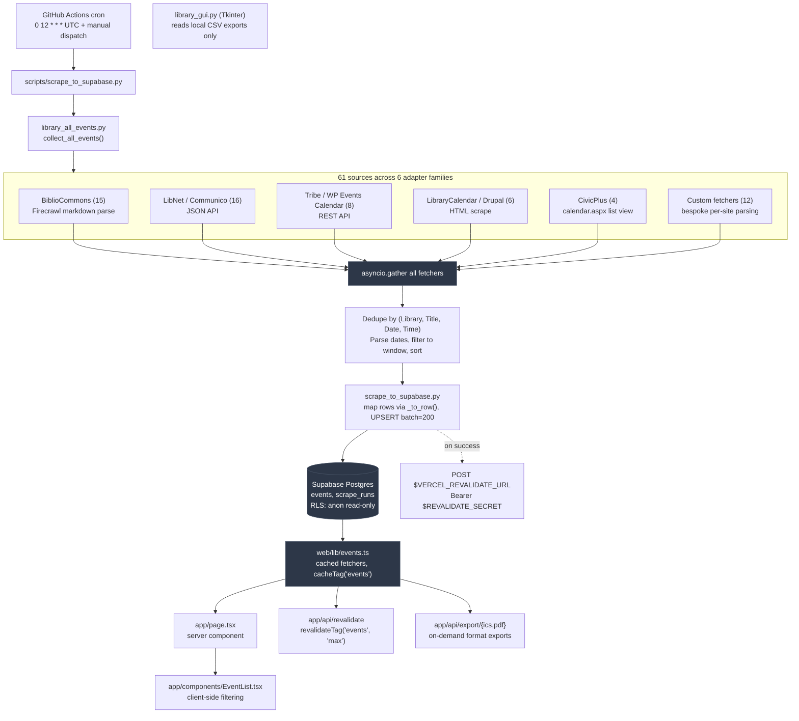

# Library Event Scraper Architecture

> Rewritten 2026-07-13 to match `main`. The previous version of this document described the
> Flask/Render.com/Firecrawl-only architecture, which was replaced by the Supabase + Vercel
> migration (see `docs/plans/2026-05-25-vercel-supabase-migration-design.md`). There is no
> Flask server, no Render/Heroku deployment, and no local CSV/PDF/ICS generation in production.

## Visual diagram (Excalidraw)

An editable, hand-drawn diagram of the current pipeline is here:
https://excalidraw.com/#json=JJe-MX2U5tS2gpXyCtm8F,0vrh_s_-i5bccS7kHSUfaA

## Data Flow Diagram


```mermaid
flowchart TD
    Cron["GitHub Actions cron\n0 12 * * * UTC + manual dispatch"] --> Adapter["scripts/scrape_to_supabase.py"]

    Adapter --> Collect["library_all_events.py\ncollect_all_events()"]

    subgraph Fetchers["61 sources across 6 adapter families"]
        BC["BiblioCommons (15)\nFirecrawl markdown parse"]
        LN["LibNet / Communico (16)\nJSON API"]
        TR["Tribe / WP Events Calendar (8)\nREST API"]
        LC["LibraryCalendar / Drupal (6)\nHTML scrape"]
        CP["CivicPlus (4)\ncalendar.aspx list view"]
        CU["Custom fetchers (12)\nbespoke per-site parsing"]
    end

    Collect --> Fetchers
    BC --> Gather["asyncio.gather all fetchers"]
    LN --> Gather
    TR --> Gather
    LC --> Gather
    CP --> Gather
    CU --> Gather

    Gather --> Dedupe["Dedupe by (Library, Title, Date, Time)\nParse dates, filter to window, sort"]

    Dedupe --> Adapter2["scrape_to_supabase.py\nmap rows via _to_row(), UPSERT batch=200"]

    Adapter2 --> DB[("Supabase Postgres\nevents, scrape_runs\nRLS: anon read-only")]

    Adapter2 -.->|on success| Revalidate["POST $VERCEL_REVALIDATE_URL\nBearer $REVALIDATE_SECRET"]

    DB --> Cache["web/lib/events.ts\ncached fetchers, cacheTag('events')"]

    Cache --> Page["app/page.tsx\nserver component"]
    Page --> EventList["app/components/EventList.tsx\nclient-side filtering"]

    Cache --> ApiRevalidate["app/api/revalidate\nrevalidateTag('events', 'max')"]
    Cache --> ApiExport["app/api/export/{ics,pdf}\non-demand format exports"]

    GUI["library_gui.py (Tkinter)\nreads local CSV exports only"]

    style DB fill:#2d3748,stroke:#4a5568,color:#fff
    style Gather fill:#2d3748,stroke:#4a5568,color:#fff
    style Cache fill:#2d3748,stroke:#4a5568,color:#fff
```

## Component Details

### Scraper Core (`library_all_events.py`)

**Entry point:** `collect_all_events(start_date_str=None, days=None)` — used by the Supabase
adapter. The CLI `main()` still exists for ad-hoc local runs (writes CSV/PDF/ICS), but is not
used in production.

**Process:**
1. **`_event_sources()`** — single registry of 61 `(label, fetcher lambda)` pairs across 6
   adapter families. Labels are unique and double as the dedup-key component, the frontend
   Libraries filter value, and the progress-tracking key.
2. **Concurrent fetching** — `_gather_and_filter_events()` runs all fetchers via
   `asyncio.gather()`.
3. **Zero-count detection** — a source that "succeeds" with 0 events is flagged; surfaced via
   `zero_event_sources()` / `failed_sources()`.
4. **Dedup** — by `(Library, Title, Date, Time)`.
5. **Filter + sort** — parses dates, filters to the requested window, sorts.

**Adapter families** (generic, parameterized per site — see `CLAUDE.md` for full signatures):

| Family | Sources | Method |
|--------|---------|--------|
| BiblioCommons | 15 | Firecrawl markdown parse |
| LibNet / Communico | 16 | `eeventcaldata` JSON endpoint |
| Tribe (WordPress Events Calendar) | 8 | `/wp-json/tribe/events/v1/events` REST |
| LibraryCalendar (LibraryMarket/Drupal) | 6 | `/events/upcoming` HTML scrape |
| CivicPlus / CivicEngage | 4 | `calendar.aspx?view=list` |
| Custom / bespoke | 12 | Per-site parsing (Firecrawl or requests/BeautifulSoup) |

### Supabase adapter (`scripts/scrape_to_supabase.py`)

- Creates a `scrape_runs` row with `status='running'`.
- Calls `collect_all_events()`, maps results to Supabase rows via `_to_row()` (computes
  `start_at = event_date + event_time` in `America/Chicago`).
- UPSERTs in batches of 200, `on_conflict=library,title,event_date,event_time`.
- On success: marks the run `success`; if any sources failed or returned 0 events, records them
  in `error_message` (e.g. `zero_event_sources: X, Y`) while status stays `success`; POSTs to
  `$VERCEL_REVALIDATE_URL` with the Bearer secret.
- On failure: marks the run `failed` with the exception repr.

Required env vars: `SUPABASE_URL`, `SUPABASE_SERVICE_ROLE_KEY`, `FIRECRAWL_API_KEY`. Optional:
`VERCEL_REVALIDATE_URL`, `REVALIDATE_SECRET`, `TIMEZONE`.

### Frontend (`web/`, Next.js 16 on Vercel)

- **Cache Components enabled** (`cacheComponents: true`). Event reads use `'use cache'` +
  `cacheLife` + `cacheTag('events')`.
- `getSupabase()` returns `null` if env vars are missing — degraded mode (empty list,
  "Refresh pending") so builds without Supabase configured still succeed.
- Filtering is **client-side**: `getUpcomingEvents()` returns the full upcoming window once;
  `<EventList>` filters in memory.
- `/api/revalidate` calls `revalidateTag('events', 'max')` — the second argument is required
  in Next.js 16.
- `/api/export/{ics,pdf}` render exports on demand from Supabase; no files are generated by
  the scraper.

### Desktop GUI (`library_gui.py`)

Unchanged legacy tool — reads local CSV files from a manual `python library_all_events.py`
run. **Does not read from Supabase.**

## Event Schema

```python
{
    "Library": str,
    "Title": str,
    "Date": str,             # Parseable date string
    "Time": str,              # "HH:MM AM/PM" or "All Day"
    "Location": str,
    "Age Group": str,
    "Program Type": str,
    "Description": str,
    "Link": str,              # URL or "N/A"
}
```

Mapped to Supabase columns by `_to_row()` (e.g. `Library` -> `library`). Dedup key:
`(library, title, event_date, event_time)`, enforced by a Postgres unique constraint and
matched in the Python dedup pass.

## Deployment Architecture

```
GitHub Actions (.github/workflows/scrape.yml)
  cron: 0 12 * * * UTC (06:00 CST / 07:00 CDT) + workflow_dispatch
  └─ python scripts/scrape_to_supabase.py
        ├─ collect_all_events() -> 61 fetchers via asyncio.gather
        └─ UPSERT batches of 200 -> Supabase (events, scrape_runs)
                                │
                                ▼
                       Supabase Postgres (RLS: anon read-only)
                                │
                                ▼
                       Next.js 16 on Vercel (web/)
                       - server-rendered page + client-side filtering
                       - /api/revalidate, /api/export/{ics,pdf}
```

There is no persistent disk, no Gunicorn process, and no `$PORT` binding — Vercel serves the
frontend and Supabase is the only stateful store. The GitHub Actions job is the only thing
that writes to Supabase.

## Error Handling & Resilience

- **Failure isolation** — each fetcher runs independently via `asyncio.gather`; one failing
  source doesn't stop the rest.
- **Zero-count / failed-source detection** — surfaced in the `scrape_runs.error_message` field
  rather than a log file, so it's queryable from Supabase after the fact.
- **Retry/backoff** — see `retry_with_backoff()` usage in the fetchers that need it (added for
  LibraryCalendar sources — see commit "Add retry/backoff to LibraryCalendar fetches").
- **WAF workarounds** — some sites reject `aiohttp` but accept `requests` (`_wnpld_request_async`)
  or require a browser User-Agent.

## Known gaps (as of 2026-07)

- Arlington Heights (`ahml.info`) renders events via AJAX — no fetcher yet.
- Kohl Children's Museum and the Gichigamiin (ex-Mitchell) museum had no usable feeds.
- Evanston Parks & Rec (Amilia) was investigated and intentionally not wired up — registration
  programs plus a CSRF lock made it impractical.

## Monitoring & Observability

Progress state (`scrape_progress.json`) is still written during a scraper run but is no longer
consumed by anything downstream. The source of truth for run health is the `scrape_runs` table
in Supabase: `status` (`running`/`success`/`failed`) and `error_message` (zero-event/failed
source names on an otherwise-successful run).

---

*For detailed function references and common tasks, see [CLAUDE.md](CLAUDE.md).*
